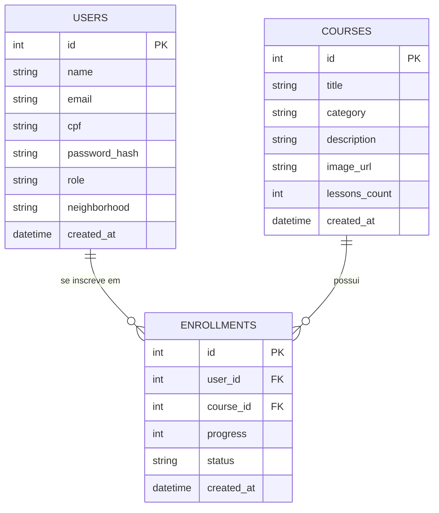

# Arquitetura do Sistema - Portal ABEMCE

Este documento detalha as decisões de design arquitetural, o modelo de dados e o fluxo de dados do Portal ABEMCE.

## Visão Geral da Arquitetura

O sistema é baseado em uma arquitetura cliente-servidor desacoplada:

1. **Frontend (Web Responsivo):**
   - Construído com HTML5 estrutural, CSS3 customizado (sem frameworks utilitários para manter a precisão do design solicitado) e Vanilla JavaScript para manipulação do DOM e consumo da API.
   - Design responsivo adaptável a desktops, tablets e smartphones usando CSS Media Queries e layouts Flexbox/Grid flexíveis.
   - Gerenciamento de estado de autenticação no lado do cliente usando o `localStorage` do navegador para armazenar de forma segura o token JWT.

2. **Backend (API RESTful):**
   - Desenvolvido com Node.js e Express.
   - Criptografia de senhas com `bcryptjs` e autenticação com `jsonwebtoken` (JWT).
   - Servidor configurado para servir arquivos estáticos do frontend, além de prover as rotas da API sob o prefixo `/api`.

3. **Banco de Dados Híbrido:**
   - **Banco Oficial:** Integração completa com o **MySQL** via driver `mysql2`.
   - **Fallback Automatizado:** Se a conexão MySQL falhar ao iniciar o servidor, o sistema ativa uma camada de persistência em memória (semeada com dados simulados realistas e contas administrativas/estudantis padrão). Isto permite testar o sistema instantaneamente sem necessitar de um banco de dados rodando.

---

## Modelo de Dados (Entidades)

O banco de dados contém as seguintes relações:

### Detalhes das Tabelas
* **USERS:** Guarda todos os usuários. O campo `role` diferencia `'student'` (aluno) de `'admin'` (administrador). O campo `neighborhood` (bairro) é usado na visualização do painel administrativo.
* **COURSES:** Armazena os cursos oferecidos. O campo `lessons_count` define o número total de aulas para cálculo dinâmico de progresso.
* **ENROLLMENTS:** Tabela de junção N-N ligando alunos a cursos, armazenando o progresso percentual (0 a 100).

---

## Fluxo de Autenticação JWT

1. O cliente envia as credenciais (E-mail/CPF + Senha) para `/api/auth/login`.
2. O servidor valida as credenciais contra a tabela `users`.
3. Se válidas, o servidor cria um Token JWT assinado com uma chave secreta contendo `{ id, name, email, role }`.
4. O cliente recebe o token e o salva no `localStorage`.
5. Em cada requisição subsequente a rotas protegidas, o cliente envia o token no cabeçalho `Authorization: Bearer <token>`.
6. O middleware de autenticação no servidor verifica o token e injeta as informações do usuário logado no objeto `req.user`.
